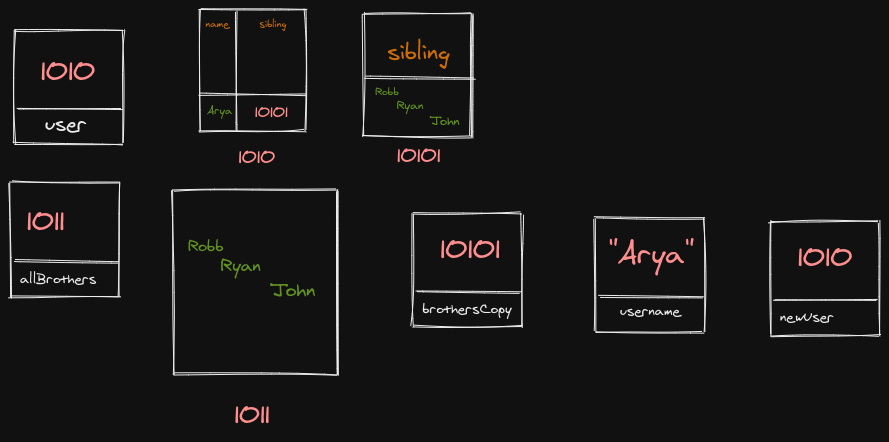

```js
let user = {
  name: 'Arya',
  sibling: ['Robb', 'Ryan', 'John'],
};
let allBrothers = ['Robb', 'Ryan', 'John'];
let brothersCopy = user.sibling;
let username = user.name;
let newUser = user;
```

1. Memory representation

- Create the memory representation of the above snippet on notebook.
- Take a photo/screenshot and add it to the folder `code`


<!-- To add this image here use  -->




2. Answer the following with reason:

- `user == newUser;` // true -- newUser is assigned the same values as user, so they are equal
- `user === newUser;` // true -- strict equals also applies here as above
- `user.name === newUser.name;` // true -- properties are copied to newUser as well, so it is true
- `user.name == newUser.name;` // true -- same as above
- `user.sibling == newUser.sibling;` // true -- each key and its value is also copied to newUser so it is true
- `user.sibling === newUser.sibling;` // true -- same as above
- `user.sibling == allBrothers;` // false -- they each have different addresses
- `user.sibling === allBrothers;` // false -- same as above 
- `brothersCopy === allBrothers;` // false -- different addresses
- `brothersCopy == allBrothers;` // false -- different addresses
- `brothersCopy == user.sibling;` // true -- since the values are copied
- `brothersCopy === user.sibling;` // true -- same as above
- `brothersCopy[0] === user.sibling[0];` // true -- first value of brothersCopy (index 0) and sibling (user.sibling[0]) are same
- `brothersCopy[1] === user.sibling[1];` // true -- same as above for index 1
- `user.sibling[1] === newUser.sibling[1];` // true -- same as above
